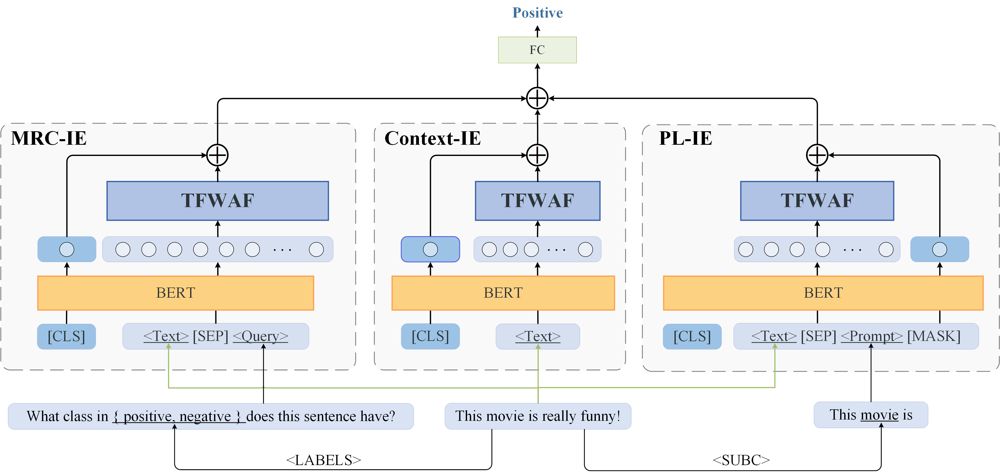
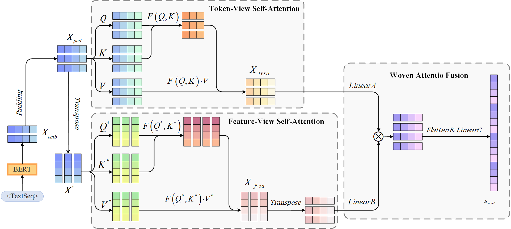

# MP-TFWA: Multi-schema powered token-feature woven attention network for short text classification


## News

* [2024-07-10]: Our paper has been accepted to PR 2024.
* [2024-03-15]: We released the code for training and inference.
* [2023-08-02]: We released the first version of our paper. 

## Overview

 [](https://github.com/Aaronzijingcai/MP-TFWA)

We have designed a novel neural network based on self-attention mechanism, named MP-TFWA. It employs a dual form to simultaneously extract semantic information from both token-level and feature-level perspectives. Additionally, we consider the MRC framework and PL framework to further unleash the potential of pre-trained language models. Ultimately, we achieved state-of-the-art performance on eight classic short-text classification datasets.





## Usage

## ⚙️Train MP-TFWA

In the following section, we describe how to train a MP-TFWA model by using our code.

### Setups

Note: Please use Python 3.10+ for MP-TFWA. To get started, simply install conda and run:

```bash
conda create -n mp-tfwa python=3.10
conda activate mp-tfwa
conda install pytorch torchvision torchaudio pytorch-cuda=11.8 -c pytorch -c nvidia
pip install -r requirement.txt
```

### DataSet

The folder "data" contains the TREC dataset for trainging and testing. As for the other datasets, you can downloaded according to paper "[MODE-LSTM: A Parameter-efficient Recurrent Network with Multi-Scale for Sentence Classification](https://github.com/qianlima-lab/MODE-LSTM)".

### Training and evaluating

The code is based on Bert-base. If you want to verify the effect of MP-TFWA combined with different PLM, please pay attention to modify the special token mark and corresponding id in data.py.

| Model   | Mark1 | Mark2   | ID             |
| ------- | ----- | ------- | -------------- |
| Bert    | [SEP] | [MASK]  | [MASK]==103    |
| Albert  | [SEP] | [MASK]  | [MASK]==4      |
| Roberta | \</s> | \<mask> | \<mask>==50264 |
| Electra | [SEP] | [MASK]  | [MASK]==103    |

You can run the command. 

```bash
python main.py
```

## 📝Citation

If this work is helpful, please kindly cite as:

```
@article{CAI2024110782,
    title = {Multi-schema prompting powered token-feature woven attention network for short text classification},
    journal = {Pattern Recognition},
    volume = {156},
    pages = {110782},
    year = {2024},
    issn = {0031-3203},
    doi = {https://doi.org/10.1016/j.patcog.2024.110782},
    url = {https://www.sciencedirect.com/science/article/pii/S0031320324005338},
    author = {Zijing Cai and Hua Zhang and Peiqian Zhan and Xiaohui Jia and Yongjian Yan and Xiawen Song and Bo Xie}
}
```

## Star History

